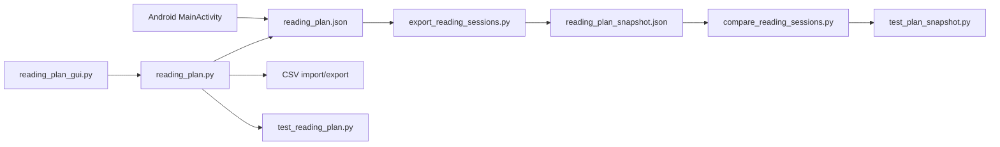

# Repository architecture

This repository contains two clients for the same reading-plan domain plus command-line snapshot tools. The Python implementation is the reference calculation and persistence model: `reading_plan.py` owns books, sessions, schedules, CSV/JSON conversion, and conflict-safe writes; `reading_plan_gui.py` composes the Tk desktop UI. `reading-plan-android/app` is an independent Java client with corresponding model, scheduler, views, and schema version 8 handling. `reading_plan.json` is the working document; `reading_plan_snapshot.json` deliberately excludes automatic sync metadata.

The main lifecycle is load document → restore baseline and overrides → render or edit → calculate remaining views → atomically save with revision/hash checks. Desktop and Android must preserve the persisted schema and stable IDs; they do not share executable code. See [planning and scheduling](../planning/scheduling.md), [JSON persistence](../persistence/json.md), and [Android](../android/app.md).

## Boundaries

The core has no external Python dependencies and is usable independently of Tk. The GUI owns presentation, dialogs, tab navigation, and autosave. Android owns its platform file picker and UI. Snapshot scripts compare user-meaningful state rather than timestamps, revision, or device identity. There is no server, database, queue, or network API.
