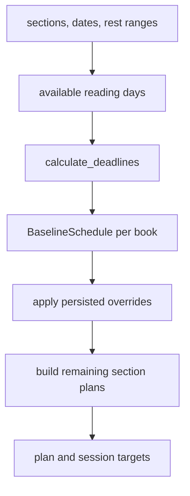

# Schedule calculation and overrides

`build_section_plans` adapts the generic `build_plan` flow to each section's units: pages for physical/digital books and seconds for audiobooks. `available_reading_days` creates an inclusive date sequence excluding normalized `RestDayRange` intervals. `calculate_deadlines` consumes books in order, assigns cumulative work to available dates, and emits `BookDeadline` rows; a simultaneous group is one scheduling unit with a shared start/deadline and proportional member targets. A zero-work/completed book receives no new work and does not consume reading capacity; its row remains completed with zero daily work. `build_plan` reports required pace as total remaining units divided by available reading days (zero when no work remains) and an unachievable status when work cannot fit.

`calculate_baseline_schedules` stores the ordinary result; `recalculate_baseline_schedules` is the explicit operation that replaces it. Progress logging, structural edits, and viewing remaining work do not silently rewrite baseline dates. `build_remaining_section_plan` schedules unfinished ordinary work from the current date, then inserts overridden books as fixed slots from their persisted baseline; overlaps or unavailable dates make the result unachievable. `apply_deadline_override` validates today/plan-end bounds, calculates remaining pace from the effective start, persists an independent schedule, and removes that member from active groups while retaining the remaining group.

`apply_start_date_override` similarly detaches/reflows as needed. Clearing overrides restores the plan/group deadline. The accepted design and consequences are recorded in `docs/adr/001-calculation-model.md` and `docs/adr/0001-persist-quarterly-baseline-schedules.md`.

Focused tests in `test_reading_plan.py` cover rest-day exclusion, grouped pace/deadlines, impossible plans, baseline persistence, override detachment/reflow, and stability after progress or structural changes. Narrow validation: `python3 -m unittest test_reading_plan.py`.
