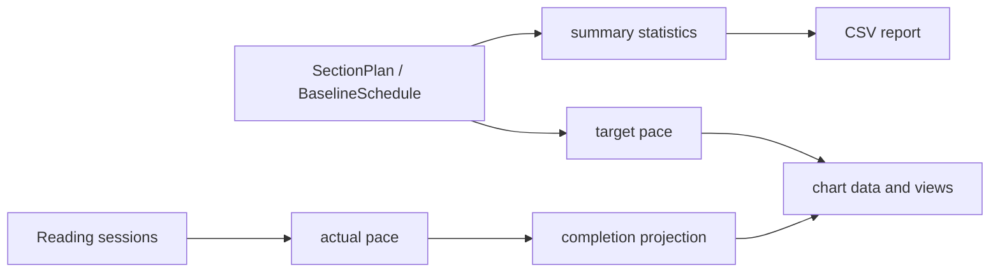

# Metrics, charts, and reports

Desktop summaries start with `SectionPlan` values and are shaped by `summarize_section_plans`, `section_plan_value`, `section_daily_pace`, `section_csv_daily_pace`, and `optional_summary_stat_rows`. `SummaryStatsOptions` toggles book counts, page/time share, averages, reading period, and pace driver. The GUI renders these rows in Plan/Charts views and uses `format_duration` for audiobook seconds; CSV reports use section-specific pace formatting.

Android separates reporting into `ReadingPlanMetricsView`, `ReadingPlanChartsView`, `ReadingPlanChartView`, `ReadingPlanChartData`, `ReadingPlanMetricsView`, and `ReadingPlanCsvReport`. Chart data aggregates persisted sessions and schedule targets by date/format. `actualReadingPace` derives observed work over reading history; `projectedCompletionDate` extrapolates remaining work from actual pace. Planned pace is the baseline target, required pace is remaining work divided by remaining reading days, and display rounding is presentation-only (page targets round up; audiobook time remains seconds/duration).

The narrow change surface for a new statistic is the core summary/data function, its GUI row or Android metrics consumer, and the corresponding report/chart formatter. Tests cover summary options, page-versus-audio conversions, target rounding, and readable audiobook output; Android has no automated test source, so chart/report changes require a Gradle build and manual inspection. See [validation](../testing/validation.md).
